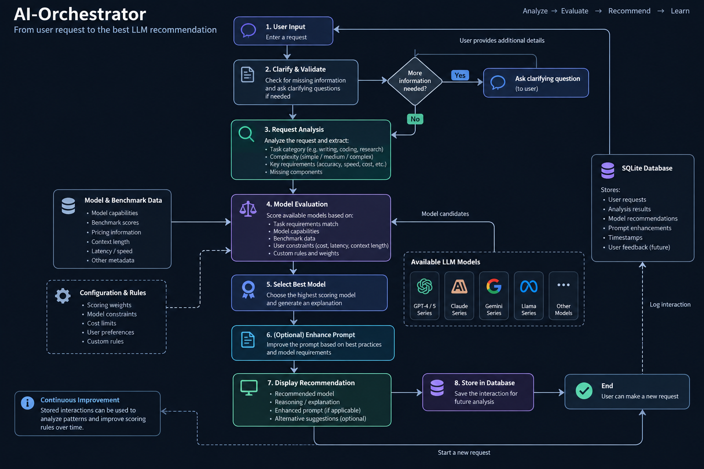

<div align="center">

# AI-Orchestrator

### From user request to the most suitable AI model.

An AI orchestration system that analyzes task requirements, improves prompts when useful, evaluates benchmark evidence, and recommends the most suitable AI model or AI assistant.

**LLM-powered request analysis · Prompt enhancement · Benchmark-informed recommendations · SQLite request history**


</div>

---

## The Problem

With hundreds of AI models and AI assistants available, choosing the right option for a specific task has become a problem of its own.

AI-Orchestrator is designed to reduce that guesswork by analyzing what the user actually needs, identifying important requirements and constraints, using benchmark evidence when available, and producing an explainable recommendation.

---

## How It Works



The orchestration pipeline moves from understanding the user's request to producing an informed recommendation while keeping each stage modular and understandable.

---

## Demo

### Request Analysis

The system analyzes the request to determine its task category, complexity, important requirements, and whether clarification is genuinely necessary.


### Prompt Enhancement

Once the request is understood, the prompt can be improved while preserving the user's original intent.


### Model Recommendation

Available AI options are evaluated against the task requirements and available benchmark evidence to produce an explainable recommendation.


> The screenshot filenames above must match the files you place inside `docs/screenshots/`.

---

## Key Features

### LLM-Powered Request Analysis

Uses Gemini to analyze the meaning of a user's request rather than relying entirely on keyword matching.

The analyzer determines:

- Whether the request is actionable
- How sufficiently specified the request is
- Whether clarification is genuinely necessary
- The most important clarification question, when needed
- The primary task category
- Estimated complexity
- Meaningfully missing request components

### Focused Clarification Handling

When critical information is missing, the system asks **one focused clarification question** rather than overwhelming the user with multiple questions.

### Prompt Enhancement

Once a request is understood, Gemini transforms it into a clearer and more structured prompt.

The prompt enhancer:

- Preserves the user's original intent
- Does not invent requirements
- Does not ask additional questions
- Produces a prompt ready to send to another AI model

### Prompt Quality Scoring

The enhanced prompt is evaluated against five detectable components:

- Context
- Role
- Task
- Output
- Format

### Benchmark-Informed Model Recommendations

The system fetches current benchmark data from Artificial Analysis when an API key is available.

Relevant signals include:

- Intelligence index
- Coding index
- Mathematics index
- Model pricing data
- Output speed

Benchmark data is used as evidence rather than as an automatic ranking system.

### Smart AI Model Recommendation

The system currently recommends from:

- ChatGPT
- Claude Sonnet
- Claude Opus
- Gemini Flash
- Gemini Pro
- Microsoft Copilot

Recommendations consider:

- Task type
- Complexity
- Reasoning requirements
- Coding requirements
- Microsoft ecosystem relevance
- Product fit
- Available benchmark evidence

The system does not automatically recommend the most powerful model.

---

## Recommendation Strategy

AI-Orchestrator intentionally avoids simple rules such as:

> "Claude is best for coding."

Instead, the recommendation process considers the actual requirements of the request.

For example:

- A simple writing task does not automatically require the most powerful model.
- Coding benchmarks matter more for coding-related requests.
- Reasoning and intelligence benchmarks matter more for complex analytical tasks.
- Microsoft Copilot receives special consideration for Microsoft ecosystem workflows.
- Benchmark scores are considered evidence, not absolute truth.

The goal is to recommend the **most suitable option for the specific task**, not simply the highest-ranked model.

---

## Database Architecture

Every request is stored in a local SQLite database, creating an auditable history of how the orchestration system processed the request.

The system records:

- Original user requests
- Clarification questions and answers
- Request analysis results
- Enhanced prompts
- Prompt quality scores
- Task categories
- Final model recommendations
- Recommendation reasons
- Request status

### `requests`

Stores the primary orchestration request and its final processing results.

### `interactions`

Stores events associated with a request, including:

- User requests
- Clarification questions
- Clarification answers
- Cancellations

Each interaction is linked to its parent request through a foreign key.

---

## Architecture

| Component | Path | Role |
|---|---|---|
| Entry Point | `main.py` | Coordinates the complete orchestration workflow |
| Request Analyzer | `request_analyzer.py` | Analyzes actionability, clarity, task category, complexity, and clarification needs |
| Prompt Enhancer | `prompt_enhancer.py` | Improves the request while preserving user intent |
| Prompt Scorer | `prompt_scorer.py` | Detects context, role, task, output, and format components |
| Model Recommender | `model_recommender.py` | Recommends AI models and assistants based on task compatibility |
| Benchmark Provider | `benchmark_provider.py` | Retrieves live benchmark data from Artificial Analysis |
| Database Layer | `database.py` | Manages SQLite storage and request history |
| Legacy Validator | `validator.py` | Earlier rule-based request validation logic retained during development |

---

## Requirements

- Python 3.x
- Gemini API key
- Artificial Analysis API key for live benchmark data

Dependencies:

- `google-genai`
- `python-dotenv`
- `pydantic`
- `requests`

---

## Setup

### 1. Clone the repository

```bash
git clone https://github.com/BavlyWilliam/AI-Orchestrator.git
cd AI-Orchestrator
```

### 2. Create and activate a virtual environment

```bash
python -m venv .venv
```

**Windows PowerShell:**

```bash
.venv\Scripts\Activate.ps1
```

### 3. Install dependencies

```bash
pip install google-genai python-dotenv pydantic requests
```

### 4. Create a `.env` file

```env
GEMINI_API_KEY=your_gemini_api_key
ARTIFICIAL_ANALYSIS_API_KEY=your_artificial_analysis_api_key
```

> The Artificial Analysis API key is optional. If benchmark data cannot be retrieved, the system continues without live benchmark data.

### Security

API keys are loaded through environment variables.

**Never commit your `.env` file or `orchestrator.db` to the repository.**

---

## Running the Project

```bash
python main.py
```

Example request:

```text
Help me debug a Python script that is failing to connect to a SQLite database.
```

---

## Project Structure

```text
AI-Orchestrator/
│
├── main.py
├── request_analyzer.py
├── prompt_enhancer.py
├── prompt_scorer.py
├── model_recommender.py
├── benchmark_provider.py
├── database.py
├── validator.py
│
└── Screenshots/
	└── architecture.png
│
├── README.md
├── LICENSE
└── .gitignore
```

---

## Testing

Test the recommendation system with different types of requests.

### Clear Request

```text
Write a Python script that organizes files.
```

Expected behavior:

- No unnecessary clarification
- Correct task classification
- Appropriate model recommendation

### Broad but Usable Request

```text
Create a marketing plan for a coffee shop.
```

Expected behavior:

- Process the request without automatically asking multiple questions
- Use reasonable assumptions

### Ambiguous Request

```text
Help me with my project.
```

Expected behavior:

- Recognize that critical context is missing
- Ask one focused clarification question

### Microsoft Ecosystem Request

```text
Help me create a complex Excel dashboard.
```

Expected behavior:

- Give Microsoft Copilot meaningful consideration

---

## Current Development Status

The project currently supports:

- LLM-based request analysis
- Focused clarification handling
- Prompt enhancement
- Prompt component scoring
- Live benchmark retrieval
- AI model compatibility scoring
- SQLite request and interaction history

### Planned Development

Future development may include:

- Structured automated test suites
- Expanded benchmark sources
- Configurable recommendation strategies
- More supported models and AI products
- Model performance evaluation
- Provider routing and execution
- Cost-aware recommendation modes
- Recommendation performance tracking

---

## Design Philosophy

> AI orchestration should make meaningful decisions based on the user's actual request, not just keyword matching or arbitrary scores.

The project prioritizes:

- Explainable decisions
- Modular architecture
- Small focused components
- Minimal unnecessary clarification
- Benchmark evidence without blind ranking
- Practical product fit
- Incremental development
- Readability and maintainability

---

## License

This project is licensed under the MIT License.

Built independently by **Bavly William**.
