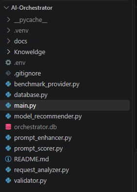
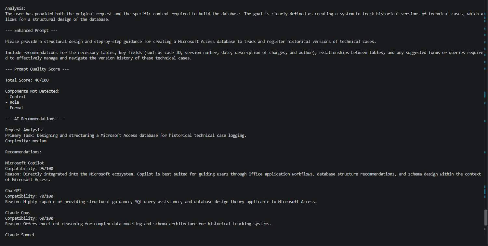
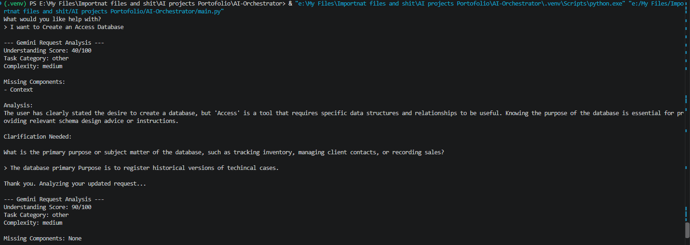
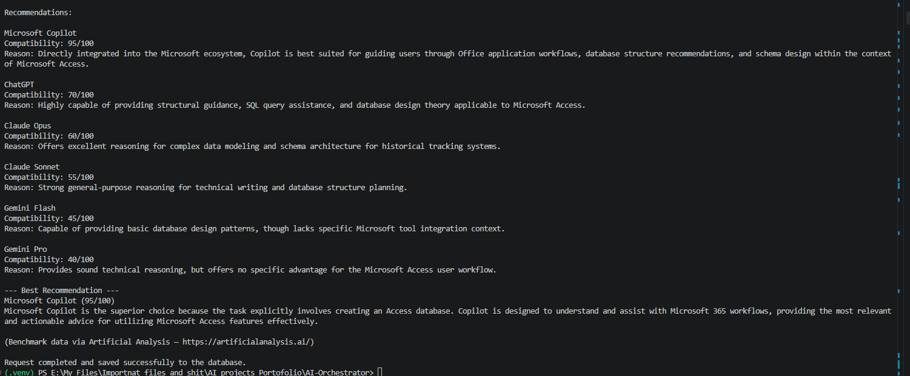
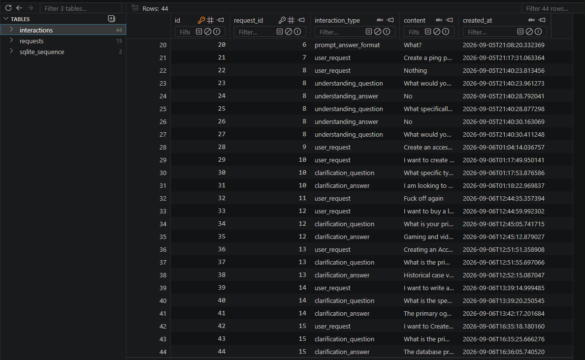
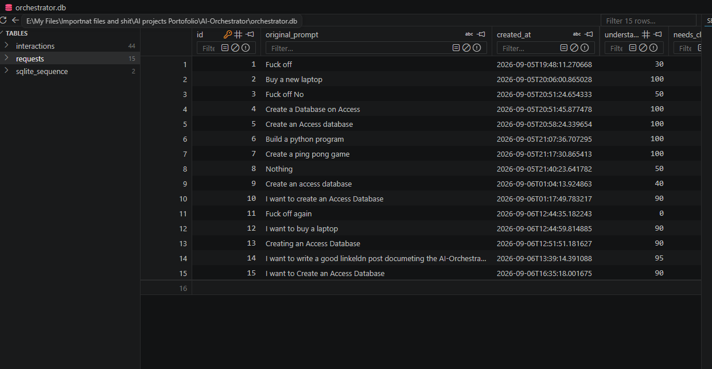
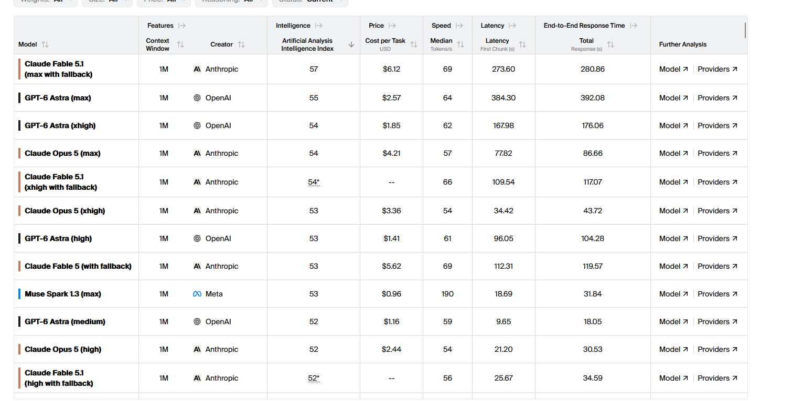
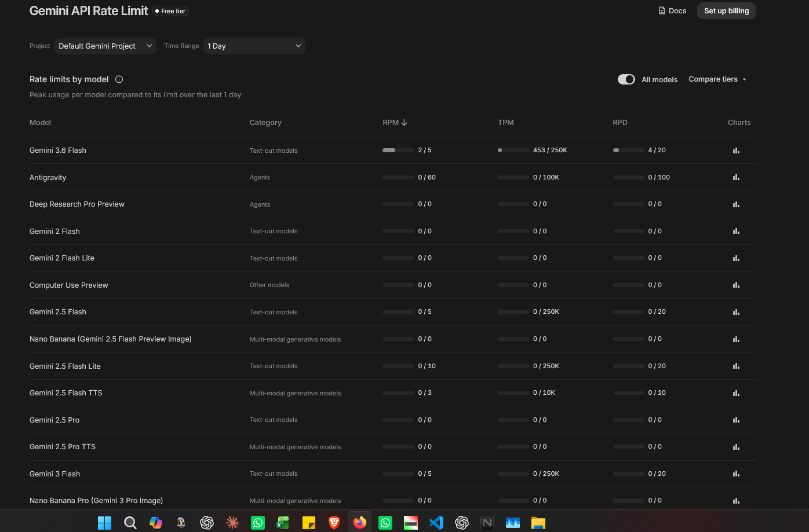

<div align="center">

# AI-Orchestrator

### From user request to informed AI model recommendations

An AI orchestration project that analyzes user requests, identifies requirements, enhances prompts when useful, evaluates available models, considers benchmark information and practical constraints, and produces an explainable recommendation.

**Request Analysis · Prompt Enhancement · Prompt Scoring · Model Recommendation · Benchmark Data · SQLite History**

</div>

---

# The Problem

With hundreds of AI models and assistants available, choosing the right model for a specific task has become a problem of its own.

AI-Orchestrator explores a structured approach to this problem by analyzing what the user actually needs, identifying important requirements and constraints, and evaluating suitable AI models instead of relying on a universal ranking.

The objective is not to determine the "best model overall."

The objective is to recommend the **most suitable model for the specific request**.

---

# How It Works


The orchestration process moves from understanding the user's request to evaluating suitable AI models and storing the resulting interaction.

---

# Project Screenshots

## 1. Project Folder Architecture



---

## 2. Request Analysis and Enhanced Prompt



---

## 3. Prompt Scoring



---

## 4. LLM Recommendation



---

## 5. Database Interactions



---

## 6. Database Requests



---

# Benchmark and Model Data

## Artificial Analysis Leaderboard



---

## AI vs Rate Limits



---

# Additional Screenshots


---

# Features

## Request Analysis

The system analyzes user requests to identify:

- Task category
- Complexity
- Important requirements
- Constraints
- Missing information
- Whether clarification is necessary

## Clarification

When critical information is missing, the system can request additional details while avoiding unnecessary clarification.

## Prompt Enhancement

AI-Orchestrator can improve the structure and clarity of a request while preserving the user's original intent.

## Prompt Scoring

Prompts can be evaluated using detectable components such as:

- Context
- Role
- Task
- Output expectations
- Format

The score is used as a signal rather than as an absolute measure of prompt quality.

## Model Recommendation

The recommendation process considers the specific requirements of the request, including:

- Task requirements
- Complexity
- Reasoning requirements
- Model capabilities
- Practical constraints
- Benchmark information
- Model compatibility

## Database History

SQLite is used to store orchestration data and interaction history.

---

# Project Structure

```text
AI-Orchestrator/
│
├── __pycache__/
├── .venv/
│
├── docs/
│   └── Screenshots/
│       ├── analysis-and-enhanced-prompt.png
│       ├── ai-rate-limits.png
│       ├── artificial-analysis-leaderboard.png
│       ├── database-interactions.png
│       ├── database-requests.png
│       ├── folder-architecture.png
│       ├── llm-recommendation.png
│       ├── Other Screenshots.png
│       └── prompt-scoring.png
│
├── Knowledge/
│   └── general_sop.md
│
├── .env
├── .gitignore
├── benchmark_provider.py
├── database.py
├── main.py
├── model_recommender.py
├── orchestrator.db
├── prompt_enhancer.py
├── prompt_scorer.py
├── README.md
├── request_analyzer.py
└── validator.py
```

---

# Core Modules

| Module | Responsibility |
|---|---|
| `main.py` | Coordinates the application workflow |
| `request_analyzer.py` | Analyzes user requests and extracts requirements |
| `validator.py` | Supports validation and clarification logic |
| `prompt_enhancer.py` | Improves and structures prompts |
| `prompt_scorer.py` | Evaluates prompt components |
| `model_recommender.py` | Evaluates and recommends AI models |
| `benchmark_provider.py` | Retrieves benchmark and model information |
| `database.py` | Manages SQLite storage and interaction history |

---

# Installation

```bash
git clone https://github.com/BavlyWilliam/AI-Orchestrator.git
cd AI-Orchestrator
python -m venv .venv
```

### Windows PowerShell

```powershell
.venv\Scripts\Activate.ps1
```

---

# Environment Variables

API credentials should be stored locally in a `.env` file.

```env
GEMINI_API_KEY=your_api_key
ARTIFICIAL_ANALYSIS_API_KEY=your_api_key
```

**Never commit real API keys to GitHub.**

---

# Running the Project

```bash
python main.py
```

---

# Current Development Focus

The current project includes:

- Request analysis
- Clarification handling
- Prompt enhancement
- Prompt scoring
- Model recommendation
- Benchmark and model data
- Rate limit considerations
- SQLite interaction history

---

# Security

Sensitive files should not be committed to the repository.

Recommended `.gitignore` entries:

```text
.env
.venv/
__pycache__/
*.db
```

---

# License

This project is licensed under the MIT License.

---

<div align="center">

Built by **Bavly William**

</div>
